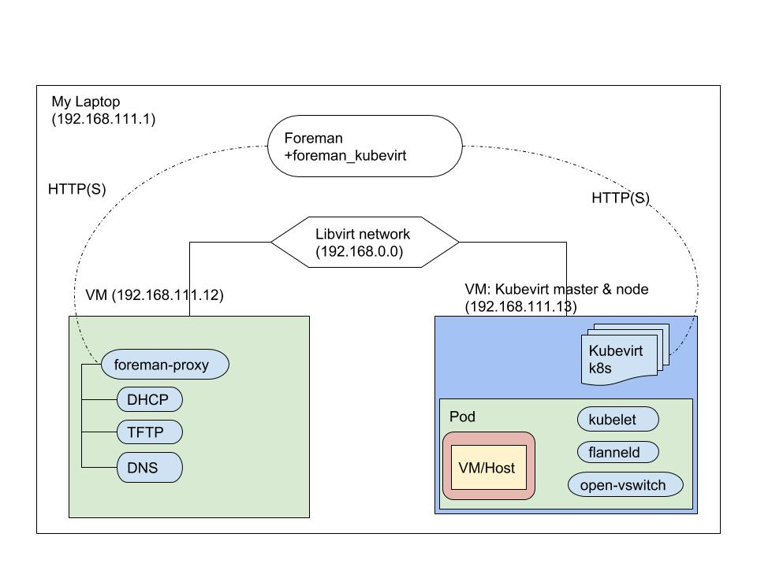

## Building development setup

In order to contribute to foreman-kubevirt integration, there is a need to setup a development environment.
The development environment should contain two VMs running on the development machine (i.e. laptop).

### Development machine configuration
The virtual machines are scheduled on the development machine.
Foreman development environment is located on the development machine, created by following [Foreman's guide](https://theforeman.org/contribute.html) .

Two libvirt networks are defined:
* default - provides external connectivity
* foreman - inner network that connects the VMs (foreman <--> kubevirt <--> foreman-proxy). The network will serve for booting KubeVirt's VM from a PXE server.
  * Address on development machine: 192.168.111.1
  * The domain *example.tst*
```
<network ipv6='yes'>
  <name>foreman</name>
  <forward mode='nat'/>
    <nat>
      <port start='1024' end='65535'/>
    </nat>
  </forward>
  <bridge name='foreman' stp='on' delay='0'/>
  <mac address='54:54:00:47:13:0b'/>
  <domain name='example.tst'/>
  <ip address='192.168.111.1' netmask='255.255.255.0'/>
</network>
```

The following chart shows the different components of the development environment:


---

The VMs will be created based on the following settings:
Operating system: CentOS 7.5
The domain: example.tst
The network to connect the VMs and serves as PXE boot network: 192.168.111.0

### VM **foreman-proxy.example.tst**
VM **foreman-proxy.example.tst** serves as the utilities vm and somewhat simulates foreman [capsule](https://theforeman.org/plugins/katello/2.4/user_guide/capsules/index.html).
Hostname: foreman-proxy.example.tst
IP Address: 192.168.111.12
Network interfaces:
* eth0 connected to *default* network
* eth1 connected to 'foreman' network
The following service should be installed and configured:
* foreman-proxy - connects foreman's to the required services listed below
* dhcpd - manages IP addresses for the created hosts
* tftp - manages boot files for PXE boot from foreman
* named - manages host names 
* vsftp - stores local installation media

The output of avaiable service on such machine should look like:
```
Proto Recv-Q Send-Q Local Address           Foreign Address         State       PID/Program name
tcp        0      0 192.168.111.12:8000     0.0.0.0:*               LISTEN      1015/ruby
tcp        0      0 0.0.0.0:7911            0.0.0.0:*               LISTEN      1021/dhcpd
tcp        0      0 192.168.111.12:53       0.0.0.0:*               LISTEN      1056/named
tcp        0      0 127.0.0.1:53            0.0.0.0:*               LISTEN      1056/named
tcp        0      0 0.0.0.0:22              0.0.0.0:*               LISTEN      1014/sshd
tcp        0      0 127.0.0.1:25            0.0.0.0:*               LISTEN      1431/master
tcp        0      0 127.0.0.1:953           0.0.0.0:*               LISTEN      1056/named
tcp6       0      0 :::8140                 :::*                    LISTEN      1069/java
tcp6       0      0 ::1:53                  :::*                    LISTEN      1056/named
tcp6       0      0 :::21                   :::*                    LISTEN      1025/vsftpd
tcp6       0      0 :::22                   :::*                    LISTEN      1014/sshd
tcp6       0      0 ::1:25                  :::*                    LISTEN      1431/master
tcp6       0      0 ::1:953                 :::*                    LISTEN      1056/named
udp        0      0 192.168.111.12:53       0.0.0.0:*                           1056/named
udp        0      0 127.0.0.1:53            0.0.0.0:*                           1056/named
udp        0      0 0.0.0.0:67              0.0.0.0:*                           1021/dhcpd
udp        0      0 0.0.0.0:68              0.0.0.0:*                           15150/dhclient
udp        0      0 0.0.0.0:69              0.0.0.0:*                           1026/xinetd
udp6       0      0 ::1:53                  :::*                                1056/named
udp6       0      0 :::69                   :::*                                1/systemd
```

The same machine will be used to store also the installation media for Foreman, unless preferred using the web as the source.

### VM **kubevirt.example.tst**
This vm will have the kubernetes cluster and kubevirt addon installed.
The instruction of installing this node relies on the following links, based on Centos 7.5:
* https://kubernetes.io/docs/setup/independent/install-kubeadm/
* https://kubernetes.io/docs/setup/independent/create-cluster-kubeadm/
* https://kubernetes.io/docs/setup/cri/#docker
* http://kubevirt.io/2018/attaching-to-multiple-networks.html
* https://github.com/kubevirt/cluster-network-addons-operator

#### Install open-vswitch
openvswitch will be used for connecting the VM to host networking using veth pairs.
* Install openvswitch >= 2.9 `yum install openvswitch` ( package can be taken from koji)
* Create bridge named ***foreman*** and connect to eth1 (interface that is connected to libvirt's ***foreman*** network)
```
ovs-vsctl add-br foreman
ovs-vsctl add-port foreman eth1
```

#### Firewall rules
```
firewall-cmd --permanent --zone=public --add-port=6443/tcp 
firewall-cmd --permanent --zone=public --add-port=10250-10252/tcp 
firewall-cmd --permanent --zone=public --add-port=2379-2380/tcp 
firewall-cmd --permanent --zone=public --add-port=30000-32767/tcp
firewall-cmd --reload
# Verify the configured ports
firewall-cmd --list-all
```
#### Enable IP Forwarding
```
cat <<EOF >  /etc/sysctl.d/k8s.conf
net.bridge.bridge-nf-call-ip6tables = 1
net.bridge.bridge-nf-call-iptables = 1
EOF
sysctl --system

modprobe br_netfilter
 ```

 #### Install Kubernetes and KubeVirt
 * Make sure to add kubernetes repository to /etc/yum.repos.d (see [here](https://kubernetes.io/docs/setup/independent/install-kubeadm/))

```
kubeadm config images pull
swapoff -a # should be disabled permanantly by commenting the swap on /etc/fstab
kubeadm init --pod-network-cidr=10.244.0.0/16 --apiserver-advertise-address=192.168.111.13
systemctl enable kubelet
```

Copy kubernetes configuration file to home directory:
```
mkdir -p $HOME/.kube
sudo cp -i /etc/kubernetes/admin.conf $HOME/.kube/config
sudo chown $(id -u):$(id -g) $HOME/.kube/config
```

Let kubernetes master serve as a node:
`kubectl taint nodes --all node-role.kubernetes.io/master-`

Install KubeVirt, Flannel and Cluster Network Operator:
```
kubectl apply -f https://raw.githubusercontent.com/coreos/flannel/master/Documentation/kube-flannel.yml

# Check for latest version
RELEASE=v0.16.0
kubectl apply -f https://github.com/kubevirt/kubevirt/releases/download/${RELEASE}/kubevirt.yaml

kubectl apply -f https://raw.githubusercontent.com/kubevirt/ovs-cni/master/examples/kubernetes-ovs-cni.yml

NET_RELEASE=0.5.0
kubectl apply -f https://raw.githubusercontent.com/kubevirt/cluster-network-addons-operator/master/manifests/cluster-network-addons/${NET_RELEASE}/namespace.yaml
kubectl apply -f https://raw.githubusercontent.com/kubevirt/cluster-network-addons-operator/master/manifests/cluster-network-addons/${NET_RELEASE}/network-addons-config.crd.yaml
kubectl apply -f https://raw.githubusercontent.com/kubevirt/cluster-network-addons-operator/master/manifests/cluster-network-addons/${NET_RELEASE}/operator.yaml

cat <<EOF | kubectl create -f -
---
apiVersion: networkaddonsoperator.network.kubevirt.io/v1alpha1
kind: NetworkAddonsConfig
metadata:
  name: cluster
spec:
  imagePullPolicy: Always
  kubeMacPool: {}
  multus: {}
```

Download ***virtctl*** tool for managing VMs on kubevirt:
```
wget https://github.com/kubevirt/kubevirt/releases/download/${RELEASE}/virtctl-v${RELEASE}-linux-amd64 -O /usr/local/bin/virtctl
chmod +x /usr/local/bin/virtctl
```

Set CPU and Memory per slice:
```
cat > /etc/systemd/system/kubelet.service.d/11-cgroups.conf <<EOF
[Service]
CPUAccounting=true
MemoryAccounting=true
EOF
```

Start kubelet service:
```
systemctl daemon-reload
systemctl restart kubelet
```

Define network attachment definition on k8s that supports 'foreman' ovs bridge:
```
cat <<EOF | kubectl create -f -
apiVersion: "k8s.cni.cncf.io/v1"
kind: NetworkAttachmentDefinition
metadata:
  name: ovs-foreman
spec:
  config: '{
      "cniVersion": "0.3.1",
      "name": "ovs-foreman",
      "plugins" : [
        {
          "type": "ovs",
          "bridge": "foreman"
        },
        {
          "type": "tuning"
        }
      ]
    }'
EOF
```

##### Create priviledged user with cluster-role
The following will create a service account eligible for both k8s and virt resources:
```
cat <<EOF | kubectl create -f -
apiVersion: v1
kind: ServiceAccount
metadata:
  name: foreman-account
  namespace: default
---
apiVersion: rbac.authorization.k8s.io/v1
kind: ClusterRoleBinding
metadata:
  name: foreman-cluster-admin
roleRef:
  apiGroup: rbac.authorization.k8s.io
  kind: ClusterRole
  name: cluster-admin
subjects:
- kind: ServiceAccount
  name: foreman-account
  namespace: default
EOF
```

Obtain the account's token by:
```
KUBE_SECRET=`kubectl get sa foreman-account -o jsonpath='{.secrets[0].name}'`
kubectl get secrets $KUBE_SECRET -o jsonpath='{.data.token}' | base64 -d | xargs
```

### Test the environment

Create VMI (Virtual Machine Instance):
```
cat <<EOF | kubectl create -f -
apiVersion: kubevirt.io/v1alpha3
kind: VirtualMachineInstance
metadata:
  creationTimestamp: null
  labels:
    special: vmi-multus
  name: vmi-multus
spec:
  domain:
    cpu:
      cores: 1
    devices:
      disks:
      - disk:
          bus: virtio
        name: vmi-multus-pvc
        bootOrder: 2
      interfaces:
      - bridge: {}
        name: ovs-foreman-net
        macAddress: de:00:00:11:11:de
        bootOrder: 1
    machine:
      type: q35
    resources:
      requests:
        memory: 512M
  networks:
  - multus:
      networkName: ovs-foreman
    name: ovs-foreman-net
  terminationGracePeriodSeconds: 0
  volumes:
  - name: vmi-multus-pvc
    containerDisk:
      image: kubevirt/fedora-cloud-registry-disk-demo
status: {}
EOF
```

To confirm the VMI was created check:
```
kubectl get vmi
```

To open a VNC console to the VM use:
```
virtctl vnc vmi-multus
```

#### Purge KubeVirt and Kubernetes
For purging the KubeVirt environment, please follow the next steps:
```
export LABEL=kubevirt.io
export KUBEVIRT_NAMESPACE=kubevirt

for entity in deployment ds rs pods validatingwebhookconfiguration services pvc pv clusterrolebinding rolebinding roles clusterroles serviceaccounts configmaps secrets customresourcedefinitions
do
  kubectl delete $entity -l $LABEL -n $NAMESPACE
done

kubectl delete network-attachment-definitions.k8s.cni.cncf.io --all
kubectl delete -f https://raw.githubusercontent.com/intel/multus-cni/master/images/multus-daemonset.yml
kubectl delete -f https://raw.githubusercontent.com/coreos/flannel/master/Documentation/kube-flannel.yml

RELEASE=v0.16.0
kubectl delete -f https://github.com/kubevirt/kubevirt/releases/download/${RELEASE}/kubevirt.yaml

kubectl delete -f https://raw.githubusercontent.com/kubevirt/ovs-cni/master/examples/ovs-cni.yml
```

For purging entire Kubernetes:
```
kubectl drain kubevirt.example.tst --delete-local-data --force --ignore-daemonsets
kubectl delete node kubevirt.example.tst
kubeadm reset --force
rm -rf /var/lib/etcd/*
```
